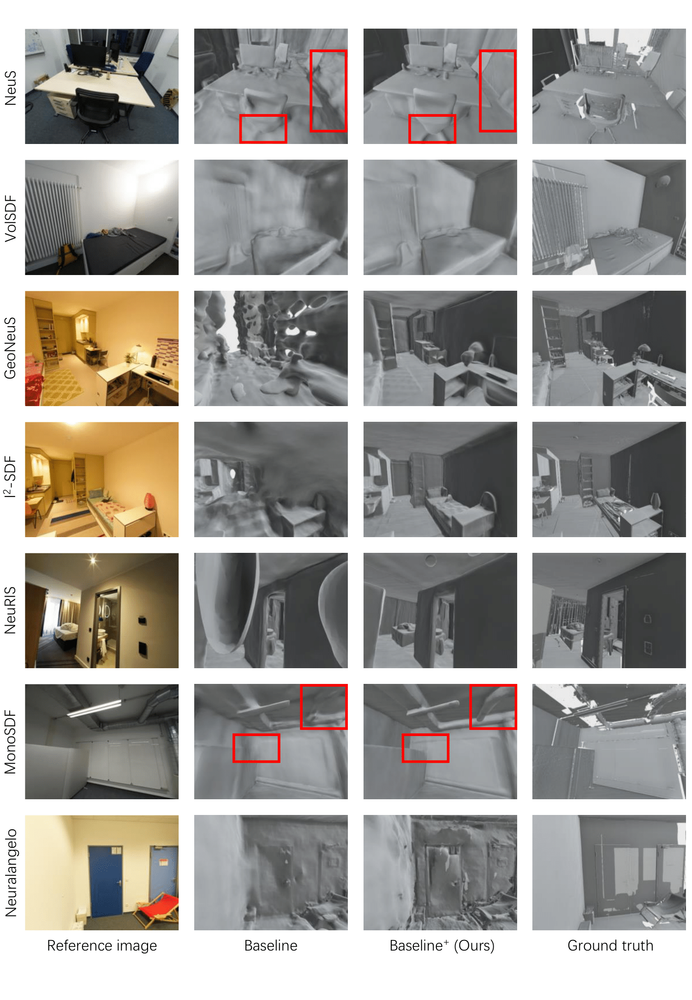

# InfoNorm

This is the official repo for the implementation of **[ECCV 2024] InfoNorm: Mutual Information Shaping of Normals for Sparse-View Reconstruction**.



### Environment

> conda env create -f environment.yml

This script is only for reference.

For fair competition, we use a thirdparty [Raytracing](https://github.com/ashawkey/raytracing) to cull the unseen mesh from training views. We slightly modify the script to support the newer cuda version in [third_pary/raytracing](third_pary/raytracing).

For some hash-grid based methods which depend tiny-cuda-cnn, you also need follow the install intructions from [tiny-cuda-cnn](https://github.com/NVlabs/tiny-cuda-nn).

You can feel free to raise issues if you encounter any problems.

### Data

The indoor scene dataset are borrowed from [ScanNet++](https://kaldir.vc.in.tum.de/scannetpp/). You can apply and download the dataset according to the instructions on the website.

### Preprocess

We provide lots of scripts to process the various datasets.

You can follow the instruction in [dataset/scannetpp_convert.sh](dataset/scannetpp_convert.sh) to generate the data from raw ScanNet++.

The main steps are as follows:

1. Undistort the scenes you want to evaluate.

2. Convert the colmap to NeuS-like npz file of camera poses

3. Predict the normal and the vision feature. We use the [Surface Normal Uncertainty](https://github.com/baegwangbin/surface_normal_uncertainty) and [dino-vits-features](https://github.com/ShirAmir/dino-vit-features) to generate cues for most of methods.

4. (Optional) For some methods(MonoSDF, GeoNeuS), they need extra cues, you can follow their instructions to generate.

### Run

We provide a shell script `run.sh` to run the code for various methods.

### The Key Idea

If you really don't like reading other people's code and are constrained by the tedious preprocessing process,we also provide core scripts to help you to add our ideas to your framework.

Please refer to [core_idea.py](core_idea.py) to quickly understand our ideas and add this cool idea to your fancy framework.

### Acknowledgement

Some code snippets are borrowed from these repository. Thanks for all these pretty great works.

[NeuS](https://github.com/Totoro97/NeuS), [NeuRIS](https://github.com/jiepengwang/NeuRIS), [GeoNeuS](https://github.com/GhiXu/Geo-Neus), [i2-SDF](https://github.com/jingsenzhu/i2-sdf), [MonoSDF](https://github.com/autonomousvision/monosdf), [NeuralAngelo](https://github.com/NVlabs/neuralangelo), [VolSDF](https://github.com/lioryariv/volsdf),
[JacobiNeRF](https://github.com/xxm19/jacobinerf), [raytracing](https://github.com/ashawkey/raytracing).

Thanks for the indoor scenes dataset [Scannet++](https://kaldir.vc.in.tum.de/scannetpp/), [Replica](https://github.com/facebookresearch/Replica-Dataset). We use the  [Pre-rendered Replica Data](https://www.dropbox.com/scl/fo/puh6djua6ewgs0afsswmz/AGudMbll0n0v_iADmqrrRds?rlkey=ep5495umv628y2sk8hvnh8msc&e=1&dl=0) from [Semantic-NeRF](https://github.com/Harry-Zhi/semantic_nerf)

### Citation

We will appreciate cite as below if you find this repository is helpful to your project

```
Coming soon
```
